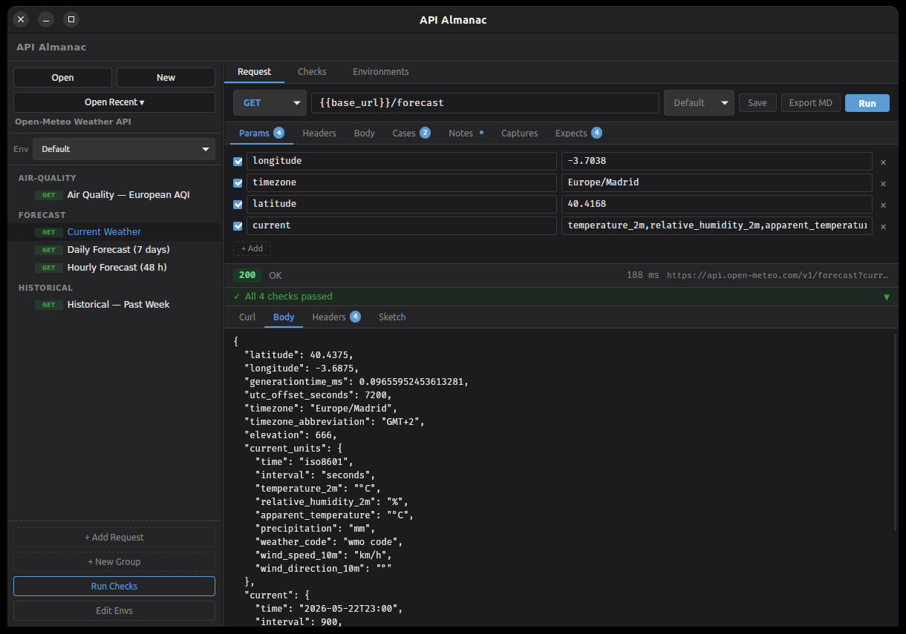

# API Almanac

**A local-first workbench for exploring, saving, and rerunning HTTP API calls.**

API Almanac is a free, open-source desktop app that turns exploratory HTTP calls into durable, revisitable knowledge. Send requests, save responses, generate type sketches, add notes, and run lightweight spot checks — all in plain YAML files you own.

> API Almanac is not an enterprise API platform. It is a developer's field notebook for APIs, with executable requests and response archaeology.




---

## Features

- **Request editor** — method, URL, query params, headers, body (JSON / form / text)
- **Cases** — named variable overrides per request (e.g. `valid-user`, `invalid-email`); select a case at run time or cycle through all in a spot-check
- **Environment system** — named variable sets (`local`, `staging`, `production`) with `{{double_braces}}` template syntax; environments can inherit from a parent env so shared variables (tenant IDs, auth tokens, API versions) live in one place; secrets read from OS environment variables at runtime via `{{secret.VAR_NAME}}`; last-used environment is remembered per project
- **Expectations** — lightweight assertions on status code, response time, headers, and JSON fields; configure directly in the GUI and view pass/fail after every run
- **Captures** — extract values from responses (JSON paths, headers) into named session variables for use in subsequent requests; live preview of captured values in the editor
- **Response viewer** — pretty-printed JSON, headers, status badge, duration
- **Checks panel** — inline pass/fail summary shown after every project request run, with expected vs. actual values
- **TypeSketch** — automatically infers the observed response shape as a readable YAML sketch
- **Notes** — per-request freeform notes saved to YAML and included in Markdown exports
- **Spot-check runner** — run all project requests in sequence, carry captured values forward, export a Markdown report
- **Markdown export** — generate a readable Markdown notebook for any request: definition, cases, expectations, last response, and type sketch
- **Response persistence** — saves the last response per request to `.api-almanac/`; shows it automatically when you reopen a request
- **Analyzer plugins** — run any external executable against the current response; receive HTML / YAML / Markdown artifacts back. Plugins can be written in any language.
- **CLI** — `almanac` binary for `list`, `run`, `spot-check`, `sketch`, and `export-md` without opening the GUI

### Sidebar and project management

- **Folder groups** — create, rename, and delete request groups; move requests between groups
- **Drag-and-drop reordering** — reorder both groups and requests within groups
- **Duplicate request** — right-click any request to clone it with a single action
- **Recent projects** — quickly reopen recently used projects from the sidebar

### Local-first and Git-friendly

All project data lives in plain YAML files you control. No accounts, no cloud, no lock-in. Projects are structured to diff cleanly and commit safely.

```
my-api/
  almanac.yaml
  environments/
    local.yaml
    staging.yaml
  requests/
    auth/
      login.yaml
    users/
      create.yaml
      get.yaml
  .api-almanac/        ← generated; add to .gitignore if preferred
    responses/
```

---

## Screenshots

> _Screenshots coming soon._

---

## Getting started

### Prerequisites

| Tool | Version |
|---|---|
| [Rust](https://rustup.rs) | stable (2021 edition) |
| [Node.js](https://nodejs.org) | 18 or later |
| [Tauri v2 prerequisites](https://v2.tauri.app/start/prerequisites/) | platform-specific (WebView2 on Windows, webkit2gtk on Linux) |

### Run in development

```bash
git clone https://github.com/your-org/apialmanac-rust
cd apialmanac-rust
npm install
npm run tauri dev
```

The app window opens automatically. The Vite dev server runs at `http://localhost:1420` and Rust hot-reloads on file change.

### Build for release

```bash
npm run tauri build
```

The installer is written to `src-tauri/target/release/bundle/`.

### Run the CLI

```bash
cargo build -p api-almanac-cli

# list all requests in the current project
cargo run -p api-almanac-cli -- list

# run a single request with environment substitution
cargo run -p api-almanac-cli -- run requests/auth/login.yaml --env local

# run all requests as a spot check
cargo run -p api-almanac-cli -- spot-check --env staging

# infer a type sketch from the last response
cargo run -p api-almanac-cli -- sketch users.get --env local

# export a request to Markdown
cargo run -p api-almanac-cli -- export-md requests/users/get.yaml
```

The CLI walks up from the current directory to find `almanac.yaml`. Request arguments accept a file path (`requests/auth/login.yaml`) or a request ID (`auth.login`).

---

## Demo project: Open-Meteo weather API

The repository ships a ready-to-open example at `demos/open-meteo/`. It covers the [Open-Meteo](https://open-meteo.com) free weather API — no key or account required — with five requests across three endpoint families:

| Group | Request | What it does |
|---|---|---|
| `forecast` | Current Weather | Real-time temperature, wind speed, and weather code |
| `forecast` | Hourly Forecast (48 h) | Hour-by-hour temperature and precipitation for 2 days |
| `forecast` | Daily Forecast (7 days) | Sunrise/sunset, precipitation totals, and min/max temperature |
| `historical` | Past Week | Archived daily data for the last 7 days |
| `air-quality` | European AQI | PM10, PM2.5, and European Air Quality Index |

Open the project via **File → Open Project** and navigate to `demos/open-meteo/`. The `Default` environment is selected automatically; all five requests run immediately.

### How this demo was generated

This project was created entirely by an AI agent given two inputs:

1. The API Almanac project format (CLAUDE.md + the model crate structs)
2. A one-shot task prompt ([`demos/open-meteo/PROMPT.md`](demos/open-meteo/PROMPT.md))

The prompt instructed the agent to fetch the Open-Meteo documentation, read the YAML schema from the source, and emit a complete project tree — `almanac.yaml`, one environment file, and five request files with realistic defaults, cases, expectations, and notes. No hand-editing was needed after generation.

This is the intended workflow for bootstrapping any new API project with API Almanac:

1. Copy `PROMPT.md` and adapt it for your target API (point it at the right docs URL, list the endpoint families you care about).
2. Run the prompt against an AI agent that has access to the repo (e.g. Claude Code with the repo open).
3. Open the generated folder in API Almanac and start running requests.

The agent reads the canonical struct definitions directly from the source, so the generated YAML is always schema-valid. Secrets stay out of files because the prompt explicitly tells the agent to use `{{secret.VAR_NAME}}` references instead of literal values.

---

## Project structure

```
Cargo.toml                   workspace root
src-tauri/                   Tauri 2 backend + app config
  src/lib.rs                 Tauri commands
crates/
  api-almanac-model/         request / environment / project structs + YAML serde
  api-almanac-runner/        async HTTP executor (reqwest)
  api-almanac-typesketch/    infer response shape as YAML sketch
  api-almanac-export/        Markdown notebook generation
  api-almanac-tools/         external analyzer plugin contract
  api-almanac-store/         response persistence + redaction
  api-almanac-cli/           almanac binary
src/                         React + TypeScript frontend (Vite)
docs/
  BLUEPRINT.md               product vision and milestone plan
examples/
  tools/                     sample analyzer plugins
```

---

## Project file format

### `almanac.yaml`

```yaml
id: my-api
name: My API
description: Notes about the My API REST service
```

### `environments/base.yaml`

```yaml
id: base
name: Base

vars:
  tenant: acme
  auth.token: "{{secret.API_TOKEN}}"
```

### `environments/local.yaml`

```yaml
id: local
name: Local
parent: base          # inherits tenant and auth.token from base

vars:
  base_url: http://localhost:8000
```

An environment with a `parent` inherits all of the parent's variables. Its own `vars` override any keys with the same name. Chains are supported (`local → staging-defaults → base`); cycles are detected and rejected at run time.

Values using `{{secret.VAR_NAME}}` read the OS environment variable `VAR_NAME` at runtime. The secret value is never written to disk.

### `requests/users/get.yaml`

```yaml
id: users.get
name: Get user
method: GET
url: "{{base_url}}/users/{{user_id}}"

headers:
  Authorization: "Bearer {{auth.token}}"
  Accept: application/json

query:
  include: profile

expect:
  status: 200
  time_ms: "< 500"
  json:
    id: exists
    email: exists

capture:
  last_user.id: json.id

redact:
  - headers.Authorization

notes: |
  Run auth.login first to populate auth.token in the session.
  The returned user ID is captured as last_user.id.
```

#### Expectation rules

| Field | Example values |
|---|---|
| `status` | `200`, `404` |
| `time_ms` | `"< 500"`, `"<= 1000"`, `">= 100"` |
| `headers.*` | `"exists"`, `"equals application/json"`, `"contains json"` |
| `json.*` | `"exists"`, `"equals ada@example.com"`, `"contains admin"` |

JSON paths support dot notation and array indexing: `json.user.roles[0]`.

#### Cases

```yaml
cases:
  invalid-email:
    user_id: "not-a-valid-id"
```

Cases override template variables at run time. Select a case from the dropdown in the GUI, or pass `--case` to the CLI.

---

## Analyzer plugins

Plugins are external executables. API Almanac sends request + response data as JSON on stdin; the plugin writes artifacts to stdout.

Place a manifest YAML and executable in your project's `tools/` directory:

**`tools/my-plugin.yaml`**
```yaml
id: my-plugin
name: My Plugin
command:
  executable: python3
  args:
    - tools/my-plugin.py
```

**`tools/my-plugin.py`**
```python
import json, sys

bundle = json.load(sys.stdin)
body   = bundle["response"]["body"]

json.dump({
    "title": "My Plugin",
    "artifacts": [{"kind": "html", "title": "Result", "content": f"<p>{body}</p>"}],
    "diagnostics": [],
}, sys.stdout)
```

See `examples/tools/` for a working sample. Plugins can be written in any language that reads stdin and writes stdout.

---

## Running tests

```bash
cargo test --workspace
```

---

## Contributing

Contributions are welcome. Please open an issue to discuss significant changes before submitting a pull request.

- Code style: `cargo fmt` and `cargo clippy` before committing
- New Tauri commands should have corresponding TypeScript types in `src/App.tsx`
- New model behaviour should have unit tests in the relevant crate

---

## License

MIT — see [LICENSE](LICENSE).

---

## Roadmap

See [`docs/BLUEPRINT.md`](docs/BLUEPRINT.md) for the full product vision. Some areas still to explore:

- Response history (timestamped, not just latest)
- Flow definitions (ordered multi-request sequences)
- Secret backend (OS keyring, `.env` file)
- Response diff view
- OpenAPI import / hint generation
- Obsidian plugin integration
